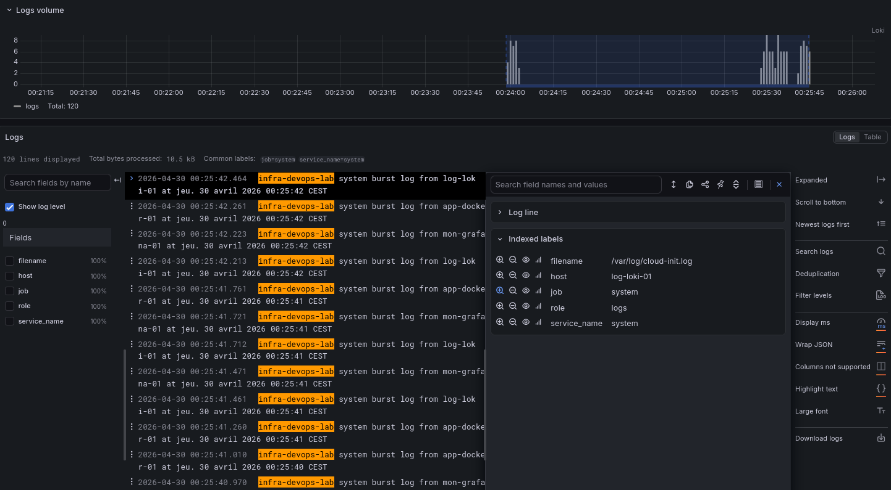

# Infra DevOps Lab

Ce projet est un lab personnel réalisé dans une démarche de montée en compétences autour des pratiques DevOps, de l’observabilité et de l’automatisation d’infrastructure.

Issu d’un parcours en administration systèmes et réseaux, l’objectif est ici de construire une infrastructure cohérente et proche de la réalité, tout en intégrant des outils et méthodes modernes (Docker, Ansible, monitoring, centralisation des logs).

---
## Aperçu

Ce lab reproduit une infrastructure segmentée avec :

- un reverse proxy en DMZ (Traefik)
- une application conteneurisée
- une stack de monitoring (Prometheus / Grafana)
- une centralisation des logs multi-machines (Loki / Promtail)
## Objectifs

- Automatiser le déploiement d’une infrastructure avec Ansible
- Mettre en place une architecture réseau segmentée (DMZ / LAN / ADMIN)
- Déployer des services conteneurisés (Docker)
- Implémenter une stack d’observabilité complète (metrics + logs)
- Centraliser les logs de plusieurs machines
- Mettre en place un reverse proxy (Traefik)

---

## Architecture

### Réseau

- **DMZ** : reverse proxy
- **LAN** : applications + monitoring + logs
- **ADMIN** : bastion Ansible

---

### Machines

| Machine            | Rôle                          |
|-------------------|------------------------------|
| adm-ansible-01    | Bastion / Ansible            |
| rp-traefik-01     | Reverse proxy (DMZ)          |
| app-docker-01     | Application Docker           |
| mon-grafana-01    | Monitoring (Prometheus)      |
| log-loki-01       | Centralisation logs (Loki)   |

---

### Flux

#### Trafic web

[User]  
↓  
[Traefik - Reverse Proxy]  
↓  
[Application Docker]

#### Metrics

[Node Exporter]
   ↓
[Prometheus]
   ↓
[Grafana]
#### Logs

[VMs]
   ↓
[Promtail]
   ↓
[Loki]
   ↓
[Grafana]


---

## Stack technique

### Infrastructure
- KVM / libvirt
- Debian 12

### Automatisation
- Ansible

### Conteneurisation
- Docker
- Docker Compose

### Observabilité
- Prometheus
- Node Exporter
- Grafana
- Loki
- Promtail

### Réseau / Reverse Proxy
- Traefik

---

##  Déploiement

Le déploiement est entièrement automatisé avec Ansible.

```bash
ansible-playbook -i inventory/hosts.ini playbooks/site.yml --ask-vault-pass
```

##  Observabilité
### Logs (Loki)

Centralisation des logs système et Docker depuis plusieurs machines, avec enrichissement via labels (`job`, `host`, `role`).

Exemples de requêtes :

```logql
{job="docker"}
```

```
{job="system"}
```

```
{job="docker"} |= "error"
```

```
{role="application"}
```
### Metrics (Prometheus)

- CPU / RAM / Disk via Node Exporter
- Visualisation via Grafana

## Exemples
### Logs centralisés avec Loki




---

# Ce que j’ai travaillé dans ce projet
- Mise en place d’une architecture segmentée
- Automatisation complète avec Ansible
- Déploiement de services conteneurisés
- Centralisation et exploitation des logs
- Mise en place d’une stack de monitoring
- Compréhension des flux (réseau, logs, metrics)

## Ce que ce projet démontre  
  
- Capacité à concevoir une architecture réseau segmentée  
- Automatisation complète d’une infrastructure avec Ansible  
- Déploiement et gestion de services conteneurisés  
- Mise en place d’une stack d’observabilité (metrics + logs)  
- Centralisation et exploitation des logs multi-machines

# Améliorations possibles

- Ajout d’alerting (Grafana / Prometheus / Loki)
- Activation et analyse des logs Traefik (HTTP access logs)
- Mise en place de TLS avec certificats valides (Let's Encrypt)
- Déploiement sur un environnement cloud (AWS / Azure)
- Ajout d’un pipeline CI/CD

# Remarques

Ce projet est avant tout un environnement d’expérimentation technique, construit pour comprendre et manipuler des briques DevOps dans un contexte cohérent.
